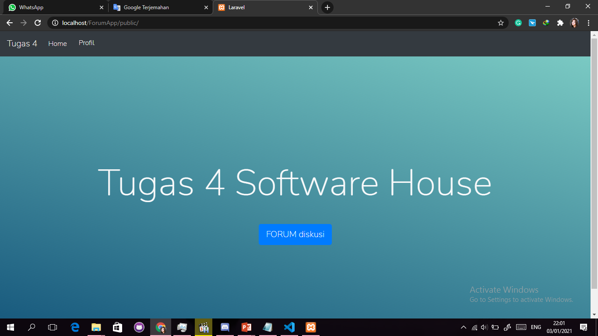
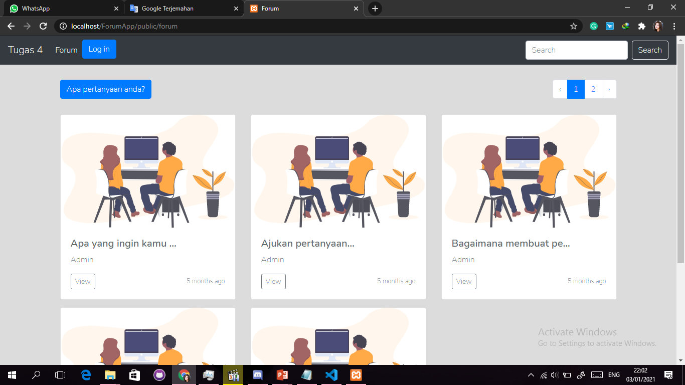
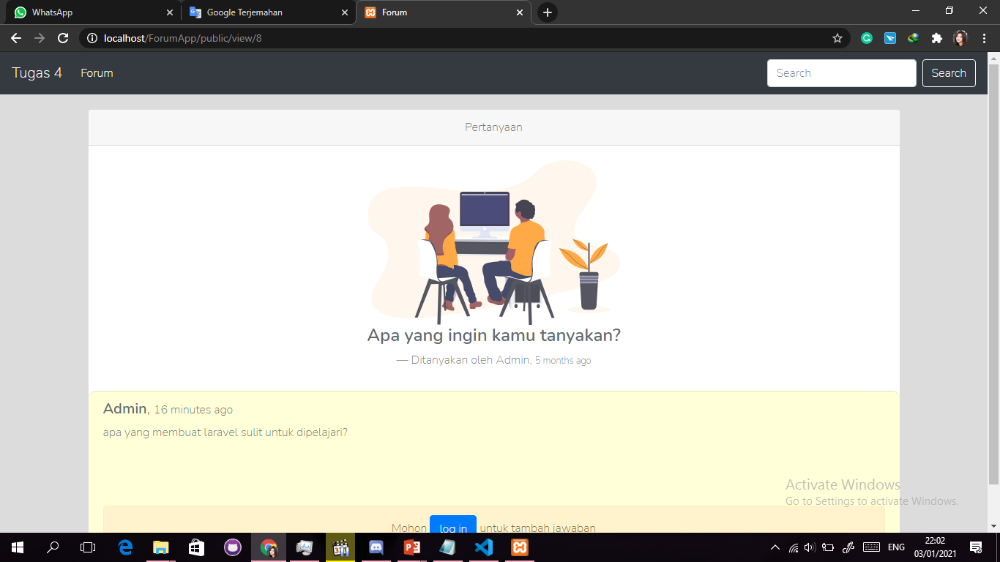
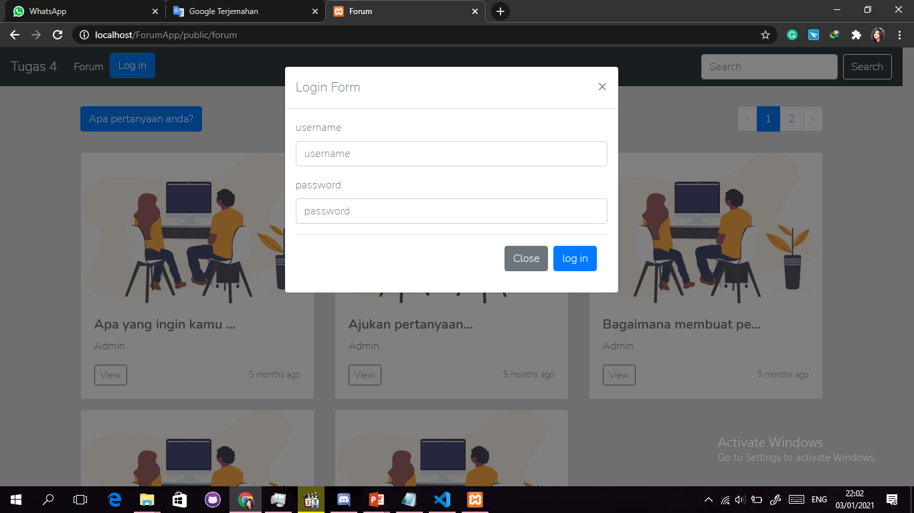
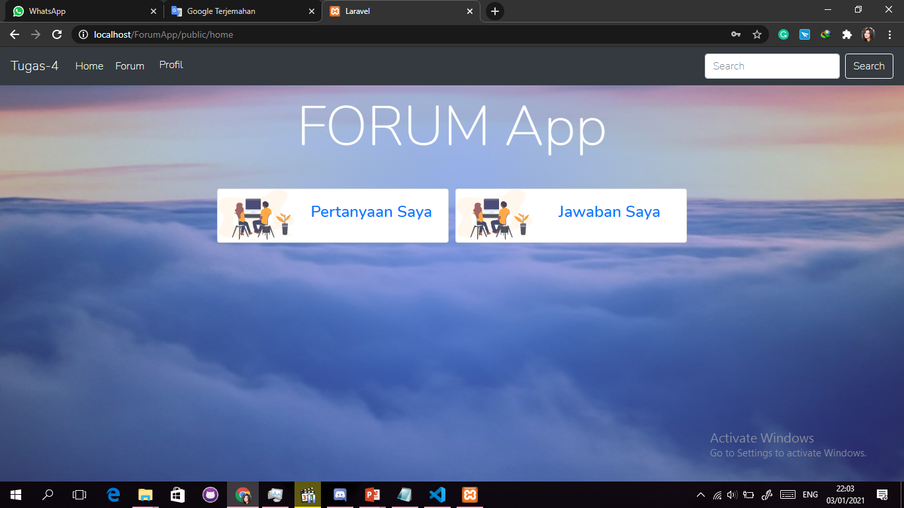
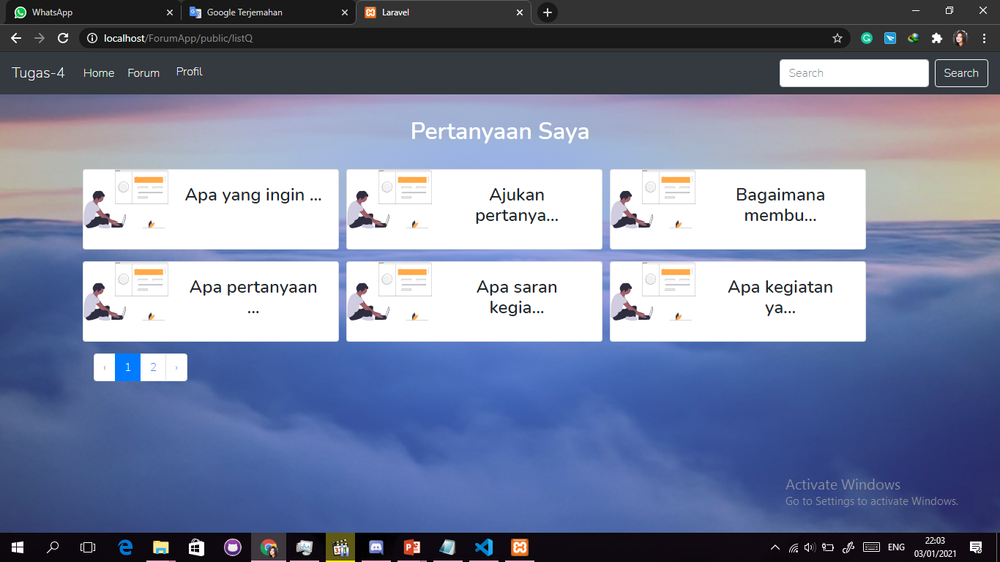
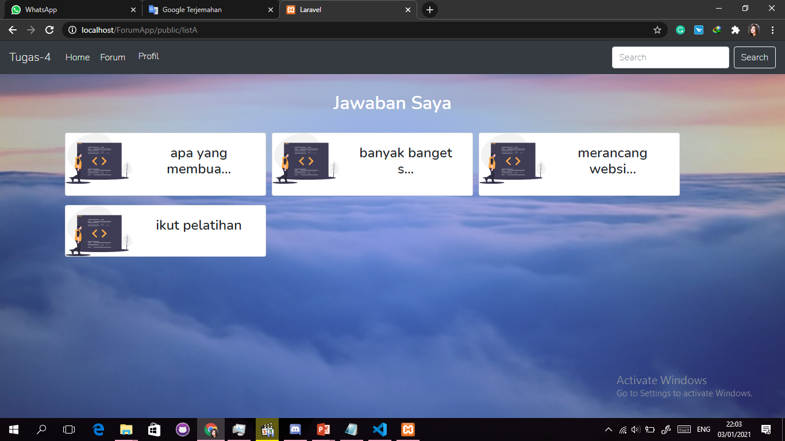

# Forum App 
from Tugas-4-Software-House-HMTC

## Deskripsi Aplikasi 📌
Forum App adalah sebuah website yang mempunyai fitur tanya jawab.
Lebih tepatnya website ini adalah penyedia sarana agar user dapat bertanya dan menjawab tentang suatu topik.

### Landing Page
Pada landing page user bisa log in atau langsung melihat forum yang tersedia dengan tombol `forum diskusi`.

### Forum
Pada page ini user dapat memilih forum diskusi yang diinginkan.

Setelah memilih forum, user dapat melihat diskusi antar user lainnya.

### LOG IN
Sebelum user dapat mulai berinteraksi, maka user diharuskan untuk log in atau sign up bila belum mempunyai akun.
Untuk sign up maka user harus kembali ke ###### Landing Page

### Home
Bila user telah log in, maka akan muncul Home Page yang menampilkan 2 pilihan, yaitu list pertanyaan yang telah ditanyakan user dan list jawaban/komentar yang telah diberikan user.

#### list pertanyaan

#### list jawaban

### Pembuatan
1. Menentukan app wire.
2. Menentukan fitur yang akan dikembangkan (user auth, posting and replying a forum).
3. Menentukan SQL database yang akan dipakai.
4. Implementasi code.

### Disclaimer
Saya sadar bahwa app ini jauh dari sempurna.
Tetapi app ini adalah awal dari pengalaman dalam pengembangan web app saya.
